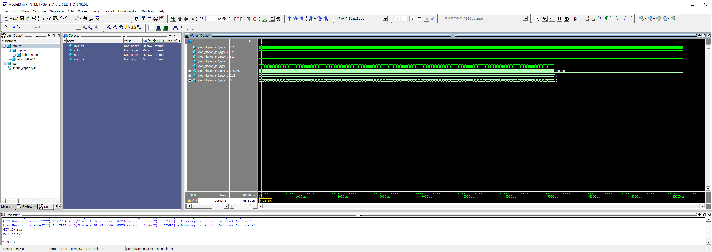
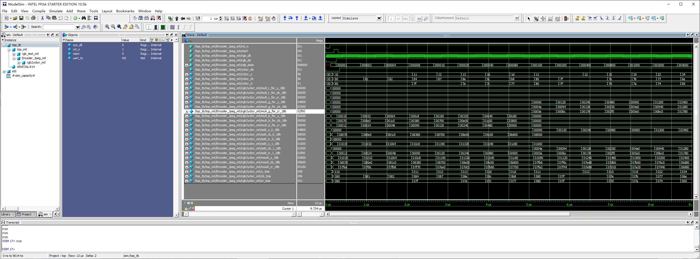

# Encoder_JPEG

**描述**：该工程在EP4CE6上实现了JPEG编码，并通过串口输出到电脑上，在电脑上保存为.jpeg文件即可打开图像。

## 工程接口

输入：（内置测试彩条图片）RGB888

输出：Jpeg码流，通过串口上传PC

## 复现过程

+ 

## 版本更新

 ### 进度更新

**20231208：**

完成top.sv 接口设计

完成rgb_test.sv 测试彩条画面输出

完成top_tb.sv测试环境生成

测试彩条生成信号符合预期

+ 上图为一个start信号，触发生成一帧RGB彩条时序

+ 上图为一行内像素赋值000001 ~ 800000H

**20231209：**

完成RGB转YCBCR模块及其仿真测试

+ 上图为RGB转YCBCR，转换值在误差范围内，例
  + 000080H RGB888 的YCBCR值为1DB877H，理论值1CB876H，误差+1，0，-1;
  + 008000H的YCBCR值为585b51H，理论值为585A51H，误差0，+1，0;
  + 800000H的YCBCR值为316DB7H，理论值316DB8H，误差0，0，-1；

