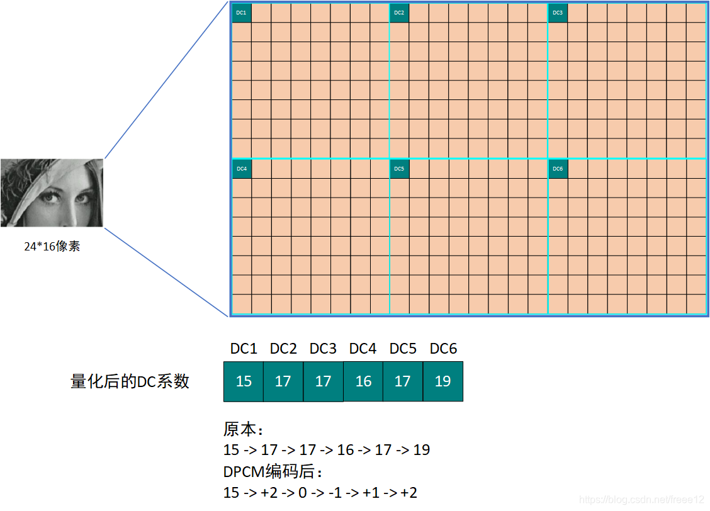
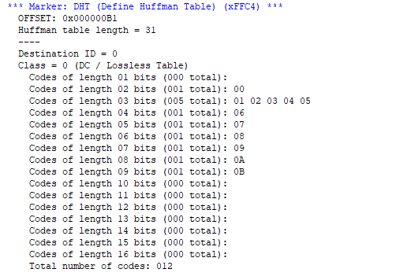
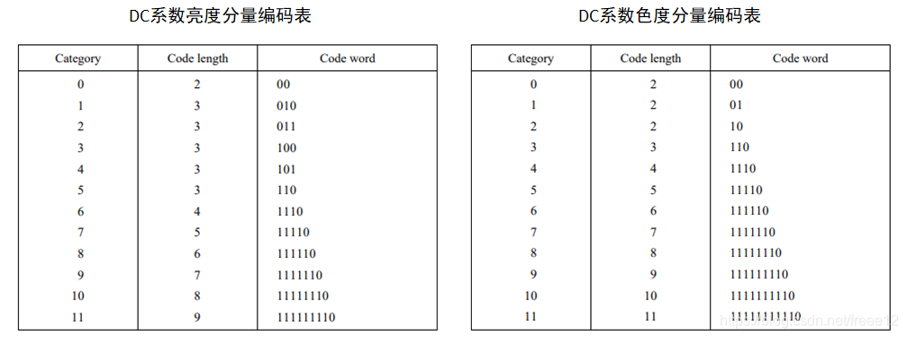
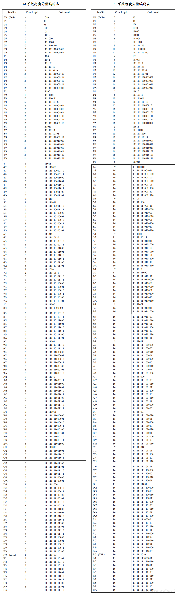

# JPEG文件格式解析

**简介**：本文档适用于未接触jpeg文件格式的人提前了解需要编解码的图片格式，对于学习和理解HDL代码结构也有一定帮助。当然，网上以及本解析仅限于个人片面理解，想要全面了解该规范的，可阅读本文件目录下ITU-T81.PDF 或者JPEG File Interchange Format Version.PDF文件

## 一、JEPG文件格式

#### 1.1 文件内容

1、使用vscode的hex编辑器打开test.jpg，可以发现文件数据的单位是一个字节8位，由16进制表示

也可以使用目录下的SpecialVIJPG_1.1.exe 或者 JPEGsnoop.exe 打开jpg文件，可以自动分析段内容，以下为一些手动分析的过程：

#### 1.2 文件结构

##### 1.2.1 文件段分类

文件**除数据起始（FF D8）和结束标志（FF D9）**以外，由多个数据段组成。

数据段的格式为 **FF + XX + XX XX+ N x 数据**。

+ FF：起始标志

+ XX : 段类型

+ XX XX ：段长度，不算起始FF和段类型，算上本指令消耗的2个字节，实际数据最大可用65533字节

  

如上图所示，例如第一个段 FF E0 00 10 4A 46 49 46 00 01 01 01 00 60 00 60 00 00 。 使用到的段类型如下：

| 段类型 | 含义 | 具体描述                                                     |
| :----: | :--: | :----------------------------------------------------------- |
|   D8   | SOI  | 必选，文件起始标志                                           |
|   E0   | APP0 | 必选，用于指示这是一张JFIF标准的JPEG图片，包含一部分基本信息 |
|   DB   | DQT  | 必选，用于存储量化表并设置对应ID，对于常见的YUV编码来说，一般有两个DQT，一个存储亮度，一个存储色度 |
| C0/C2  | SOF  | 必选，图片解析元数据，包含图片长宽、精度等信息。注：此处C0表示Baseline ，C2表示渐进式，对于网络传输来说常用于渐进式，表现为图像多次显示逐渐清晰; 对于硬件编程来说，通常使用Baseline，即扫描一次直接传输完毕，表现为图像从上到下逐渐显示 |
|   C4   | DHT  | 必选，用于存储Huffman编码的查表数据，通常有亮度/色度、DC/AC排列组合共四个表，规范中给出了一个默认的通用表，放在文末，各个应用也可以自定义自己的表 |
|   DA   | SOS  | 必选，扫描开始，包含编码通道顺序以及图像压缩等信息           |
|   D9   | EOI  | 必选，文件结束标志                                           |
|   FE   | COM  | 可选，注释内容                                               |
|   DD   | DRI  | 可选，熵编码迭代的复位标记                                   |

除以上10个通用标准以外，还有另外20个不常见的段类型此处不再展开。另外，为避免编码过程中产生 FFXX触发段类型，当数据内出现FF时，在后面强制插入00再接后面的数据。

##### 1.2.2 文件段内容解析

具体的段内容结构如下，以字节为单位：

+ SOI：

| 字节编号 | 16进制值 | 说明         |
| -------- | -------- | ------------ |
| 1        | FF       | 固定，段标志 |
| 2        | D8       | 固定，段类型 |

+ APP0：

| 字节编号 | 16进制值                            | 说明                                                      |
| -------- | ----------------------------------- | --------------------------------------------------------- |
| 1        | FF                                  | 固定，段标志                                              |
| 2        | E0                                  | 固定，段类型                                              |
| 3-4      | 00 10（默认） + 3 x N(缩略图像素数) | 自定义，段长度，如果没有缩略图就是00 10                   |
| 5-9      | 4A46494600                          | 固定，JFIF字符串                                          |
| 10-11    | 0101（默认）                        | 自定义，版本号，一般为0101，即JFIF版本 1.1                |
| 12       | 01                                  | 自定义，密度单位（0：无单位；1：点数/英寸；2：点数/厘米） |
| 13-14    | XX                                  | 自定义，图像横向像素数                                    |
| 15-16    | XX                                  | 自定义，图像纵向像素数                                    |
| 17       | 00（默认）                          | 自定义，缩略图横向像素数，没有就是00                      |
| 18       | 00（默认）                          | 自定义，缩略图纵向像素数，没有就是00                      |
| 19……     | XX                                  | 自定义，缩略图RGB数据，每3个字节为一个像素，没有就不写    |

+ DQT：

| 字节编号 | 16进制值    | 说明                                                         |
| -------- | ----------- | ------------------------------------------------------------ |
| 1        | FF          | 固定，段标志                                                 |
| 2        | DB          | 固定，段类型                                                 |
| 3-4      | 00 43(默认) | 自定义，段长度，对于8b的数据表来说，默认43，16b的数据此处为83 |
| 4        | XX          | 自定义，字节高四位（0：8b 数据 1:16b数据），低四位（0：亮度表 1：色度表），例如此处截图的为亮度表 |
| 5……      | XX          | 自定义，8x8共64个表格值，对于8b的格式，一个字节对应一个数据；对于16b的格式则需要两个字节。按照Zigzag顺序从左上往右下扫描。 |

+ SOF：

  

| 字节编号 | 16进制值      | 说明                                                         |
| -------- | ------------- | ------------------------------------------------------------ |
| 1        | FF            | 固定，段标志                                                 |
| 2        | C0            | 固定，段类型，C2等硬件不方便实现的类型暂不说明，此处只说明C0，即Baseline类型 |
| 3-4      | 00 11（默认） | 自定义，段长度                                               |
| 5        | 08            | 自定义，采样精度，Baseline只有08                             |
| 6~7      | XX XX         | 自定义，图像横向像素数                                       |
| 8~9      | XX XX         | 自定义，图像纵向像素数                                       |
| 10       | 03（默认）    | 自定义，图像分量，对于YUV来说只有3个分量，灰度就只有1个      |
| 11~13    | XX XX XX      | 自定义，分量ID 0 8b+H0分量水平采样 4b+V0分量垂直采样 4b+T0当前分量量化表ID 8b |
| 14~16    | XX XX XX      | 自定义，分量ID 1 8b+H1分量水平采样 4b+V1分量垂直采样 4b+T1当前分量量化表ID 8b |
| 17~19    | XX XX XX      | 自定义，分量ID 2 8b+H2分量水平采样 4b+V2分量垂直采样 4b+T2当前分量量化表ID 8b |
| 20……     | XX            | 自定义，YUV此处已经结束，如果其他编码方式可能还有后续的分量编码 |

注：对于11~19来说，主要定义了YUV444还是422还是420采样，并且采用哪个量化表，当然这里一般是固定的Y U V 分量编码 0 1 2，并且Y使用量化表0，U V共同使用量化表1；对于其他颜色空间等，这里可能还有别的分量，所以看起来这个描述比较复杂

+ DHT：

| 字节编号 | 16进制值 | 说明                                                         |
| -------- | -------- | ------------------------------------------------------------ |
| 1        | FF       | 固定，段标志                                                 |
| 2        | C4       | 固定，段类型                                                 |
| 3-4      | XX XX    | 自定义，段长度                                               |
| 5        | XX       | 自定义，第8~6位：固定0，第五位：0:DC直流 1:AC交流，低四位：0 亮度 1色度，因此一共有00 10 (亮度DC\AC)，10 11(色度DC\AC)四张表 |
| 6~21     | XX……     | 自定义，Huffman Table 位表，共16个字节，表示在Huffman 表中，第1~第16bit的各有多少个数据，顺序摆放。  如上图所示，将数据分为6~21部分和22~37部分，第6个字节00表示长度bit 01的有0个数据；第7个字节01表示长度bit 01的有1个数据，将第22字节放入；第8个字节05表示长度bit 01的有5个数据，将23~27字节放入，以此类推可以得到下图值表； |
| 22……     | XX……     | 自定义，Huffman Table 值表                                   |

本节涉及熵编码，在后文熵编码章节解释具体含义

+ SOS:

| 字节编号 | 16进制值 | 说明                                                         |
| -------- | -------- | ------------------------------------------------------------ |
| 1        | FF       | 固定，段标志                                                 |
| 2        | DA       | 固定，段类型                                                 |
| 3-4      | 00 0C    | 固定，段长度                                                 |
| 5        | XX       | 自定义，扫描行内组件，1:灰度图，3:YCBCR or YIQ，4:CMYK，一般为1 |
| 6，8，10 | XX       | 自定义，组件ID，01:Y，02:CB，03:CR，后面45 YUV模式用不上     |
| 7，9，11 | XX       | 自定义，Hufffman表号，高四位是AC表ID，低四位是DC表           |
| 12       | 00 3F 00 | 自定义，频谱选择的三个参数，在简化模式下可以当做常量         |
| 13……     | XX……     | 压缩的图像数据，顺序为从左到右，从上到下                     |

+ EOI：

| 字节编号 | 16进制值 | 说明   |
| -------- | -------- | ------ |
| 1        | FF       | 段标志 |
| 2        | D9       | 段类型 |

总得来说，JPEG文件基本由 SOI + APP0 + N个DQT + SOF + N个DHT + SOS + EOI 组成，具体的数据段解析到编码过程中实时解析。

## 二、jpeg文件编码过程

### 注：以下内容来自各个网文汇编，上下编码所用举例可能不一样

+ **1、输入的图像假定为长宽已知的RGB888 数据流**

  

+ **2、首先将每个像素的RGB888转为YCBCR 444**
  
  + RGB888 转 YCBCR444公式如下：
    +  ima_y = 0.256789 * ima_r + 0.504129 * ima_g + 0.097906 * ima_b + 16
    + ima_cb = -0.148223 * ima_r - 0.290992 * im_l_g + 0.439215 * ima_b + 128
    + ima_cr = 0.439215 * ima_r - 0.367789 * ima_g - 0.071426 * ima_b + 128
    
  + 考虑到硬件实现的可行性，将上列系数左移8位（等于x256），取整再做流水线运算
  
    
  
+ **3、将图像分为8x8的小块，单独处理每个小块，从左到右，从上到下，顺序处理**。对于熵编码部分，当采样为444时，块编码顺序为Y、Cb、Cr、Y、Cb、Cr……当采样顺序为422时，以每16x16为单位，编码顺序为Y、Y、Y、Y、Cb、Cb、Cr、Cr以此类推，为方便硬件实现，此处采用444处理

  

  

+ **4、将小块内每个像素值原[0~255]减去128，形成[-128~127]的对称范围**

  

+ **5、将8x8的小块进行DCT处理**

  + DCT的8x8系数矩阵如下

    + | 64   | 64   | 64   | 64   | 64   | 64   | 64   | 64   |
      | ---- | ---- | ---- | ---- | ---- | ---- | ---- | ---- |
      | 89   | 75   | 50   | 18   | -18  | -50  | -75  | -89  |
      | 83   | 36   | -36  | -83  | -83  | -36  | 36   | 83   |
      | 75   | -18  | -89  | -50  | 50   | 89   | 18   | -75  |
      | 64   | -64  | -64  | 64   | 64   | -64  | -64  | 64   |
      | 50   | -89  | 18   | 75   | -75  | 18   | 89   | -50  |
      | 36   | -83  | 83   | -36  | -36  | 83   | -83  | 36   |
      | 18   | -50  | 75   | -89  | 89   | -75  | 50   | -18  |

  

  

+ **6、将DCT后的数据按照量化表一对一整除，进行量化**

  + 通用的8x8亮度量化表如下

    + | 16   | 11   | 10   | 16   | 24   | 40   | 51   | 61   |
      | ---- | ---- | ---- | ---- | ---- | ---- | ---- | ---- |
      | 12   | 12   | 14   | 19   | 26   | 58   | 60   | 55   |
      | 14   | 13   | 16   | 24   | 40   | 57   | 69   | 56   |
      | 14   | 17   | 22   | 29   | 51   | 87   | 80   | 62   |
      | 18   | 22   | 37   | 56   | 68   | 109  | 113  | 77   |
      | 24   | 35   | 55   | 64   | 81   | 104  | 120  | 92   |
      | 49   | 64   | 78   | 87   | 103  | 121  | 120  | 101  |
      | 72   | 92   | 95   | 98   | 112  | 100  | 103  | 99   |

  + 通用的8x8色度量化表如下

    + | 17   | 18   | 24   | 47   | 99   | 99   | 99   | 99   |
    | ---- | ---- | ---- | ---- | ---- | ---- | ---- | ---- |
      | 18   | 21   | 26   | 66   | 99   | 99   | 99   | 99   |
      | 24   | 26   | 56   | 99   | 99   | 99   | 99   | 99   |
      | 47   | 66   | 99   | 99   | 99   | 99   | 99   | 99   |
      | 99   | 99   | 99   | 99   | 99   | 99   | 99   | 99   |
      | 99   | 99   | 99   | 99   | 99   | 99   | 99   | 99   |
      | 99   | 99   | 99   | 99   | 99   | 99   | 99   | 99   |
      | 99   | 99   | 99   | 99   | 99   | 99   | 99   | 99   |
  
  

  

+ **7、将量化后的小块按照Zigzag扫描成一维排列**

+ **8、将一维排列进行Huffman熵编码**

  + 为方便解释原理，此处以假设扫描后的数据串为50，57，45，0，0，0，0，23，0，-30，-16，0，0，1，0，0，0，0 ，0 ，0 ，0，..，0

  + **1、**根据DCT变换的原理，左上第一个数据为DC直流值，单独编码，剩余63个数据为AC交流值，进行另一组编码

  + **2、**对于DC直流数值，采用DPCM编码，即当前编码值=当前实际值-前一个块的DC值，对于第一个块来说，前一个块的DC值为0，即编码值50；如果当前编码值为负，用反码表示。记录当前编码bit长度以及而二进制值，

  + **2、**将剩余63个数据按照以非零数值为间隔，进行游程编码，格式为（非零数前面0的个数，非零数值）。对于上述数据，编码为(0，57) ; (0，45) ; (4，23) ; (1，-30) ; (0，-16) ; (2，1) ，最后都是0就插入一个(亮度：1010 色度：00)的EOB标志表示结束，**注：0的个数必须是0~15，用4个bit表示；如果AC系数之间连续0的个数超过16，则用一个扩展字节(15,0)来表示16连续的0**

  + **3、**按照以下JPEG中使用到的二进制编码表，对非零数进行编码，按照（非零数前面0的个数，非零数值编码Bit长度 ，二进制值），如（0，57）编码为（0，6，111001），以此类推。**注：可见，Bit长度范围也是0~15，即4个bit，因此编码时合为一个字节，高位表示0的个数，低位表示编码Bit长度**，对于DC值来说只用编码Bit长度和二进制值差值

    + | 原始数值                    | 非零数值编码Bit长度 | 二进制值    |
      | --------------------------- | ------------------- | ----------- |
      | 0                           | 1                   | 无          |
      | -1,1                        | 2                   | 0,1         |
      | -3，-2，2，3                | 3                   | 00,01,10,11 |
      | ……                          | ……                  | ……          |
      | -32767……-16384,16384……32767 | 15                  | ……          |

  + **4、**将合并的字节按照对应AC系数对应的亮度或者色度Huffman表（太长，放文章末尾了，本节末尾给出表格编码过程）进行编码，查表参数Run/size = 非零数前面0的个数 / 非零数值编码Bit长度，比如（0,6,57）对应编码值为0/6对应的111100，那么最后57的编码结果为1111000+111001，以此类推——按第1节所说单独处理的亮度DC值50会放在这串数据前面，即1110+110010，最后以对应的EOB结尾，这样就完成了一个块（亮度）的编码，按每8位一个字节进行输出，有空余补0，**然后对色度Cb，然后C分块进行同样的处理**

  

  

+ **9、读取下一个块，重复进行直至完成所有分块……**对于最后一个数据可以不给EOB，由FF D9直接结束

  

+ **10、将编码数据和参数打包为标准jpg格式（段+段的格式）输出，在第一章节已给出**

+ 附：为方便进一步理解熵编码数据，此处给出一段8x8某红色分块的解码过程，其中jpeg数据为

  16进制： **E2             E8      	   A2                8A 			F9   			93     		 F7           13**……
   2进制：11100010 11101000 10100010 10001010 11111001 10010011 11110111 00010011……

  + 1、首先解码DC系数，查DC亮度表可得开头的11100为DC数值bit长度，即6位，即后面6位001011是DC值，由于最高位为0代表负数，实际差值为-52
  + 2、开始解码后面的AC系数，但是紧接编码1010（亮度EOB），也就没有亮度AC系数
  + 3、开始解码色度Cb的DC系数，前一个字节剩余的位数舍弃，从下一个字节**A2**开始，类似的，查询色度DC表可得10为色度DC的bit长度，即2位，即后面的10是Cb分量的DC差值，也就是2
  + 4、开始解码色度Cb的AC系数，上来就是一个色度的EOB 00，理由同上，没有AC系数
  + 5、开始解码色度Cr的DC系数，从下一个字节**8A**开始，类似的，查询色度DC表可得10为色度DC的bit长度，即2位，即后面的00是Cr分量的DC差值，也就是-3
  + 6、开始解码色度Cr的AC系数，按上述编码规范可分为（1010,111）（11001,10010）……

## 三、常见问题

+ **1、如何理解编码中传输的DQT表，DHT表？**

  + DQT表是对编码数据的阶梯函数量化，数值越大，阶梯越大，损失的细节越多——用户既可以使用通用的DQT表，也可以按照自己图片的像素分布规律，定制自己的DQT表，这也是jpeg图片表现风格的特征之一

  + DHT表是对编码数据根据01分布的压缩编码，同上，可以根据通用的Huffman表，也可以按照自己的图片像素分布规律进行自定义Huffman表，以提高压缩率

  + 当然，对于FPGA硬件实现来说，如果不是特别追求图像质量，没有必要去先遍历一遍图片得到合适的编码参数，再进行图片编码，这样除了带来较大的逻辑复杂度，也降低了MJPEG编码连续图像的效率

    

+ **2、Huffman表与DHT内定义的内容是如何联系的？**

  + 以默认的Huffman 直流DC表为例，解释如何从DHT内容恢复成文末的Huffman表：下图是我们DHT段亮度直流DC的内容，解码出来直接的信息有16个计数的数据（00  01 05 01 ……），以及编码值（00 01 02 03……），编解码过程：首先Huffman的亮度DC表有16个编码，从上到下，16个编码消耗的比特为2,3,3,3,3,3,4……，最开始的16个计数数据指长度为N的编码有几个数据，如长度为2就有1个，长度为3就有5个，长度为4有一个，以此类推就得到了DHT编码内容中的（00 01 05 01 ……）
  + 然后顺序传输对应的数值，比如（00 01 02 03 04 05 06……），就知道第一个01代表bit长度为2的有一个数值，对应后面第一个数值 00，下一个05代表bit长度为3的有5个数值，对应后面第2~6个数 01 02 03 04 05，以此类推 
  + 根据前文。因为Huffman的编码是有规律可循的，可以得到具体的Code word
  + 总结：先根据既定顺序，整理出Code ledgth 一列，再根据huffman规律得到对应的Code word，最后编号Category就可以使用了

## 参考资料

+ [图形图像基础 之 jpeg介绍-CSDN博客](https://blog.csdn.net/runafterhit/article/details/119300530?ops_request_misc=%7B%22request%5Fid%22%3A%22170239782216800184127786%22%2C%22scm%22%3A%2220140713.130102334..%22%7D&request_id=170239782216800184127786&biz_id=0&utm_medium=distribute.pc_search_result.none-task-blog-2~all~top_click~default-2-119300530-null-null.142^v96^pc_search_result_base3&utm_term=jpeg&spm=1018.2226.3001.4187)
+ [JPEG原理详解(附python实现)_jpeg压缩python实现-CSDN博客](https://blog.csdn.net/qq_41137110/article/details/121724551?ops_request_misc=&request_id=&biz_id=102&utm_term=jpeg&utm_medium=distribute.pc_search_result.none-task-blog-2~all~sobaiduweb~default-2-121724551.nonecase&spm=1018.2226.3001.4187)
+ [JPEG 原理详细分析_jpeg编码原理-CSDN博客](https://blog.csdn.net/han2529386161/article/details/109777211?utm_medium=distribute.pc_relevant.none-task-blog-2~default~baidujs_utm_term~default-0-109777211-blog-78135122.235^v39^pc_relevant_3m_sort_dl_base3&spm=1001.2101.3001.4242.1&utm_relevant_index=3)
+ [程序员看的JPEG图像压缩介绍（多图慎入）_jpeg压缩-CSDN博客](https://blog.csdn.net/freee12/article/details/109953732?ops_request_misc=&request_id=&biz_id=102&utm_term=jpeg&utm_medium=distribute.pc_search_result.none-task-blog-2~all~sobaiduweb~default-4-109953732.nonecase&spm=1018.2226.3001.4187)
+ [jpeg图片格式详解_jpg文件解析-CSDN博客](https://blog.csdn.net/yun_hen/article/details/78135122?ops_request_misc=%7B%22request%5Fid%22%3A%22170271386616800197061252%22%2C%22scm%22%3A%2220140713.130102334..%22%7D&request_id=170271386616800197061252&biz_id=0&utm_medium=distribute.pc_search_result.none-task-blog-2~all~top_positive~default-1-78135122-null-null.142^v96^control&utm_term=jpeg&spm=1018.2226.3001.4187)

## 默认Huffman表

