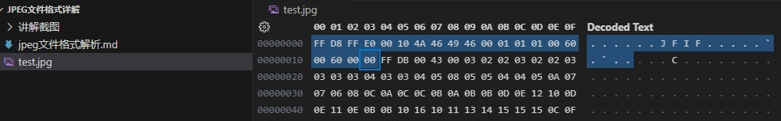
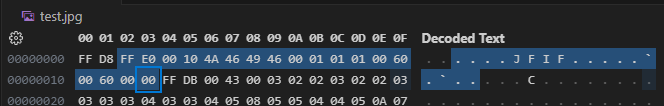
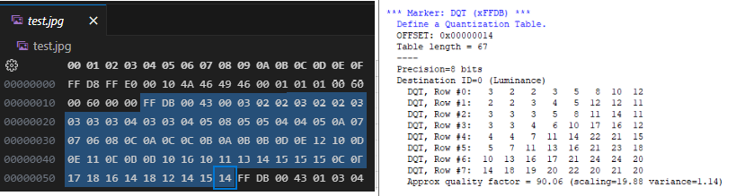
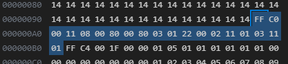
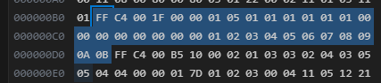
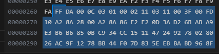
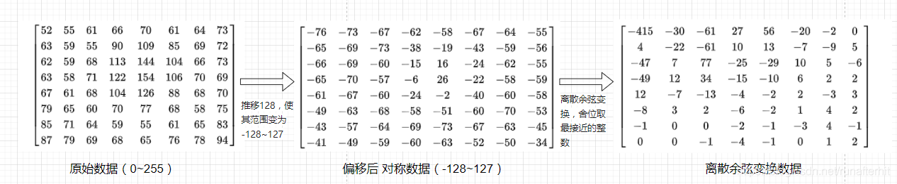
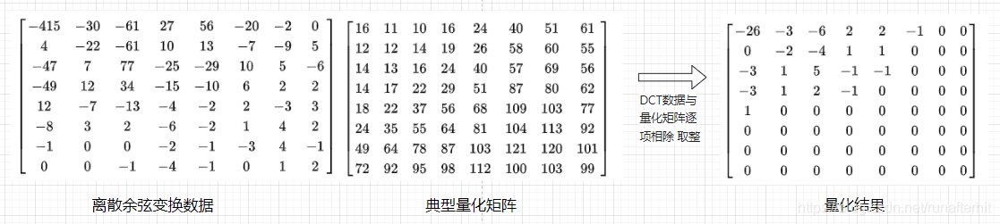
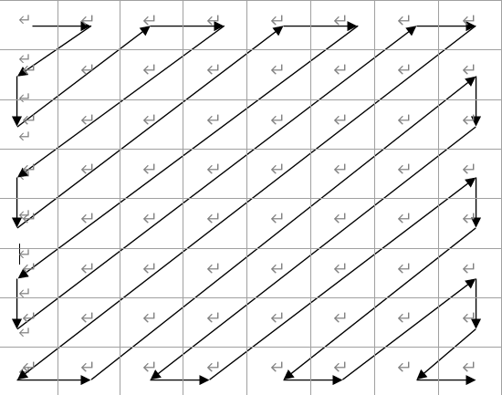
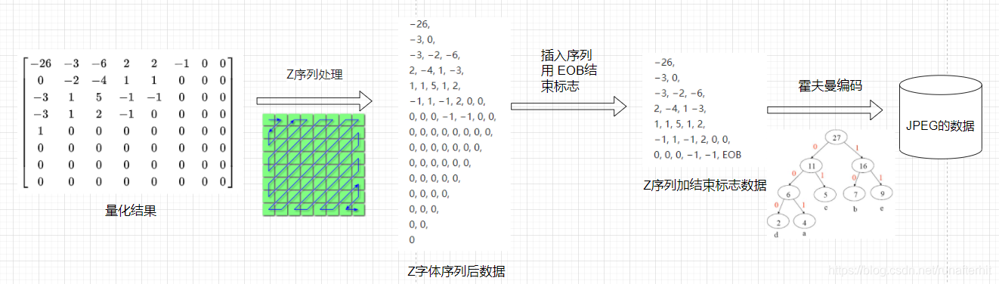

# JPEG文件格式解析

**简介**：本文档适用于未接触jpeg文件格式的人提前了解需要编解码的图片格式，对于学习和理解HDL代码结构也有一定帮助。

## 一、JEPG文件格式

#### 1.1 文件内容

1、使用vscode的hex编辑器打开test.jpg，可以发现文件数据的单位是一个字节8位，由16进制表示

#### 1.2 文件结构

##### 1.2.1 文件段分类

文件**除数据起始（FF D8）和结束标志（FF D9）**以外，由多个数据段组成。

数据段的格式为 **FF + XX + XX XX+ N x 数据**。

+ FF：起始标志

+ XX : 段类型

+ XX XX ：段长度，不算起始FF和段类型，算上本指令消耗的2个字节，实际数据最大可用65533字节

  

如上图所示，例如第一个段 FF E0 00 10 4A 46 49 46 00 01 01 01 00 60 00 60 00 00 。 使用到的段类型如下：

| 段类型 | 含义 | 具体描述                                                     |
| :----: | :--: | :----------------------------------------------------------- |
|   D8   | SOI  | 必选，文件起始标志                                           |
|   E0   | APP0 | 必选，用于指示这是一张JFIF标准的JPEG图片，包含一部分基本信息 |
|   DB   | DQT  | 必选，用于存储量化表并设置对应ID，对于常见的YUV编码来说，一般有两个DQT，一个存储亮度，一个存储色度 |
| C0/C2  | SOF  | 必选，图片解析元数据，包含图片长宽、精度等信息。注：此处C0表示Baseline ，C2表示渐进式，对于网络传输来说常用于渐进式，表现为图像多次显示逐渐清晰; 对于硬件编程来说，通常使用Baseline，即扫描一次直接传输完毕，表现为图像从上到下逐渐显示 |
|   C4   | DHT  | 必选，用于存储Huffman编码的查表数据，通常有亮度/色度、DC/AC排列组合共四个表 |
|   DA   | SOS  | 必选，扫描开始，包含编码通道选择等信息                       |
|   D9   | EOI  | 必选，文件结束标志                                           |
|   FE   | COM  | 可选，注释内容                                               |
|   DD   | DRI  | 可选，熵编码迭代的复位标记                                   |

除以上10个通用标准以外，还有另外20个不常见的段类型此处不再展开。另外，为避免编码过程中产生 FFXX触发段类型，当数据内出现FF时，在后面强制插入00再接后面的数据。

##### 1.2.2 文件段内容解析

具体的段内容结构如下，以字节为单位：

+ SOI：

| 字节编号 | 16进制值 | 说明         |
| -------- | -------- | ------------ |
| 1        | FF       | 固定，段标志 |
| 2        | D8       | 固定，段类型 |

+ APP0：

| 字节编号 | 16进制值                            | 说明                                                      |
| -------- | ----------------------------------- | --------------------------------------------------------- |
| 1        | FF                                  | 固定，段标志                                              |
| 2        | E0                                  | 固定，段类型                                              |
| 3-4      | 00 10（默认） + 3 x N(缩略图像素数) | 自定义，段长度，如果没有缩略图就是00 10                   |
| 5-9      | 4A46494600                          | 固定，JFIF字符串                                          |
| 10-11    | 0101（默认）                        | 自定义，版本号，一般为0101，即JFIF版本 1.1                |
| 12       | 01                                  | 自定义，密度单位（0：无单位；1：点数/英寸；2：点数/厘米） |
| 13-14    | XX                                  | 自定义，图像横向像素数                                    |
| 15-16    | XX                                  | 自定义，图像纵向像素数                                    |
| 17       | 00（默认）                          | 自定义，缩略图横向像素数，没有就是00                      |
| 18       | 00（默认）                          | 自定义，缩略图纵向像素数，没有就是00                      |
| 19……     | XX                                  | 自定义，缩略图RGB数据，每3个字节为一个像素，没有就不写    |

+ DQT：

| 字节编号 | 16进制值    | 说明                                                         |
| -------- | ----------- | ------------------------------------------------------------ |
| 1        | FF          | 固定，段标志                                                 |
| 2        | DB          | 固定，段类型                                                 |
| 3-4      | 00 43(默认) | 自定义，段长度，对于8b的数据表来说，默认43，16b的数据此处为83 |
| 4        | XX          | 自定义，P/T值，每个字节高四位（0：8b 数据 1:16b数据），低四位表示表行ID |
| 5……      | XX          | 自定义，8x8共64个表格值，对于8b的格式，一个字节对应一个数据；对于16b的格式则需要两个字节。按照Zigzag顺序从左上往右下扫描。 |

+ SOF：

  

| 字节编号 | 16进制值      | 说明                                                         |
| -------- | ------------- | ------------------------------------------------------------ |
| 1        | FF            | 固定，段标志                                                 |
| 2        | C0            | 固定，段类型，C2等硬件不方便实现的类型暂不说明，此处只说明C0，即Baseline类型 |
| 3-4      | 00 11（默认） | 自定义，段长度                                               |
| 5        | 08            | 自定义，采样精度，Baseline只有08                             |
| 6~7      | XX XX         | 自定义，图像横向像素数                                       |
| 8~9      | XX XX         | 自定义，图像纵向像素数                                       |
| 10       | 03（默认）    | 自定义，图像分量，对于YUV来说只有3个分量，灰度就只有1个      |
| 11~13    | XX XX XX      | 自定义，分量ID 0 8b+H0分量水平采样 4b+V0分量垂直采样 4b+T0当前分量量化表ID 8b |
| 14~16    | XX XX XX      | 自定义，分量ID 1 8b+H1分量水平采样 4b+V1分量垂直采样 4b+T1当前分量量化表ID 8b |
| 17~19    | XX XX XX      | 自定义，分量ID 2 8b+H2分量水平采样 4b+V2分量垂直采样 4b+T2当前分量量化表ID 8b |
| 20……     | XX            | 自定义，YUV此处已经结束，如果其他编码方式可能还有后续的分量编码 |

+ DHT：

| 字节编号 | 16进制值 | 说明                                                         |
| -------- | -------- | ------------------------------------------------------------ |
| 1        | FF       | 固定，段标志                                                 |
| 2        | C4       | 固定，段类型                                                 |
| 3-4      | XX XX    | 自定义，段长度                                               |
| 5        | XX       | 自定义，第8~6位：固定0，第五位：0:DC直流 1:AC交流，低四位：0 亮度 1色度 |
| 6~21     | XX……     | 自定义，Huffman Table 位表，共16个字节                       |
| 22       |          | 自定义，Huffman Table位表头和                                |

本节涉及熵编码，在后文熵编码章节解释具体含义

+ SOS:

| 字节编号 | 16进制值 | 说明                                                         |
| -------- | -------- | ------------------------------------------------------------ |
| 1        | FF       | 固定，段标志                                                 |
| 2        | DA       | 固定，段类型                                                 |
| 3-4      | 00 0C    | 固定，段长度                                                 |
| 5        | XX       | 自定义，扫描行内组件，1:灰度图，3:YCBCR or YIQ，4:CMYK，一般为3 |
| 6        | XX       | 自定义，组件ID，01:Y，02:CB，03:CR，后面45用不上             |
| 7        | XX       | 自定义，Hufffman表号，高四位是AC表ID，低四位是DC表ID         |
| 8~10     | 02 11 03 | 固定，用途不明，忽略                                         |
| 11~13    | 00 3F 00 | 固定，压缩数据开始标志                                       |
| 14……     | XX……     | 压缩的图像数据，顺序为从左到右，从上到下。                   |

+ EOI：

| 字节编号 | 16进制值 | 说明   |
| -------- | -------- | ------ |
| 1        | FF       | 段标志 |
| 2        | D9       | 段类型 |

总得来说，JPEG文件基本由 SOI + APP0 + N个DQT + SOF + N个DHT + SOS + EOI 组成，具体的数据段解析到编码过程中实时解析。

## 二、jpeg文件编码过程（根据编写进度，随时更新ing

+ **1、输入的图像假定为长宽已知的RGB888 数据流**

+ **2、首先将每个像素的RGB888转为YCBCR 444**
  + RGB888 转 YCBCR444公式如下：
    +  ima_y = 0.256789 * ima_r + 0.504129 * ima_g + 0.097906 * ima_b + 16
    + ima_cb = -0.148223 * ima_r - 0.290992 * im_l_g + 0.439215 * ima_b + 128
    + ima_cr = 0.439215 * ima_r - 0.367789 * ima_g - 0.071426 * ima_b + 128
  + 考虑到硬件实现的可行性，将上列系数左移8位（等于x256），取整再做流水线运算

+ **3、将图像分为8x8的小块，单独处理每个小块，从左到右，从上到下，顺序处理**

  

+ **4、将小块内每个像素值原[0~255]减去128，形成[-128~127]的对称范围**

+ **5、将8x8的小块进行DCT处理**

  + DCT的8x8系数矩阵如下

    + | 64   | 64   | 64   | 64   | 64   | 64   | 64   | 64   |
      | ---- | ---- | ---- | ---- | ---- | ---- | ---- | ---- |
      | 89   | 75   | 50   | 18   | -18  | -50  | -75  | -89  |
      | 83   | 36   | -36  | -83  | -83  | -36  | 36   | 83   |
      | 75   | -18  | -89  | -50  | 50   | 89   | 18   | -75  |
      | 64   | -64  | -64  | 64   | 64   | -64  | -64  | 64   |
      | 50   | -89  | 18   | 75   | -75  | 18   | 89   | -50  |
      | 36   | -83  | 83   | -36  | -36  | 83   | -83  | 36   |
      | 18   | -50  | 75   | -89  | 89   | -75  | 50   | -18  |

  

+ **6、将DCT后的数据按照量化表一对一整除，进行量化**

  + 通用的8x8亮度量化表如下

    + | 16   | 11   | 10   | 16   | 24   | 40   | 51   | 61   |
      | ---- | ---- | ---- | ---- | ---- | ---- | ---- | ---- |
      | 12   | 12   | 14   | 19   | 26   | 58   | 60   | 55   |
      | 14   | 13   | 16   | 24   | 40   | 57   | 69   | 56   |
      | 14   | 17   | 22   | 29   | 51   | 87   | 80   | 62   |
      | 18   | 22   | 37   | 56   | 68   | 109  | 113  | 77   |
      | 24   | 35   | 55   | 64   | 81   | 104  | 120  | 92   |
      | 49   | 64   | 78   | 87   | 103  | 121  | 120  | 101  |
      | 72   | 92   | 95   | 98   | 112  | 100  | 103  | 99   |

      

  + 通用的8x8色度量化表如下

    + | 17   | 18   | 24   | 47   | 99   | 99   | 99   | 99   |
      | ---- | ---- | ---- | ---- | ---- | ---- | ---- | ---- |
      | 18   | 21   | 26   | 66   | 99   | 99   | 99   | 99   |
      | 24   | 26   | 56   | 99   | 99   | 99   | 99   | 99   |
      | 47   | 66   | 99   | 99   | 99   | 99   | 99   | 99   |
      | 99   | 99   | 99   | 99   | 99   | 99   | 99   | 99   |
      | 99   | 99   | 99   | 99   | 99   | 99   | 99   | 99   |
      | 99   | 99   | 99   | 99   | 99   | 99   | 99   | 99   |
      | 99   | 99   | 99   | 99   | 99   | 99   | 99   | 99   |

  

+ **7、将量化后的小块按照Zigzag扫描成一维排列**

+ **8、将一维排列进行Huffman熵编码（待更新**

  + JPEG中使用到的二进制编码

  + | 原始数值                | Bit长度 | 实际保存值                      |
    | ----------------------- | ------- | ------------------------------- |
    | 0                       | 0       | 无                              |
    | -1,1                    | 1       | 00,01,10,11                     |
    | -3，-2，2，3            | 2       | 000,001,010,011,100,101,110,111 |
    | ……                      | ……      | ……                              |
    | -2047……-1024,1024……2047 | 11      | ……                              |

  

+ **9、读取下一个小块，重复进行直至完成**

+ **10、将编码数据和参数打包为标准jpg格式（段+段的格式）输出，在第一章节已给出**

## 三、常见问题

+ **1、如何理解编码中传输的DQT表，DHT表？**
  + DQT表是对编码数据的阶梯函数量化，数值越大，阶梯越大，损失的细节越多——用户既可以使用通用的DQT表，也可以按照自己图片的像素分布规律，定制自己的DQT表，这也是jpeg图片表现风格的特征之一
  + DHT表是对编码数据根据01分布的压缩编码，同上，可以根据通用的Huffman表，也可以按照自己的图片像素分布规律进行自定义Huffman表，以提高压缩率
  + 当然，对于FPGA硬件实现来说，如果不是特别追求图像质量，没有必要去先遍历一遍图片得到合适的编码参数，再进行图片编码，这样除了带来较大的逻辑复杂度，也降低了MJPEG编码连续图像的效率

## 参考资料

+ [图形图像基础 之 jpeg介绍-CSDN博客](https://blog.csdn.net/runafterhit/article/details/119300530?ops_request_misc=%7B%22request%5Fid%22%3A%22170239782216800184127786%22%2C%22scm%22%3A%2220140713.130102334..%22%7D&request_id=170239782216800184127786&biz_id=0&utm_medium=distribute.pc_search_result.none-task-blog-2~all~top_click~default-2-119300530-null-null.142^v96^pc_search_result_base3&utm_term=jpeg&spm=1018.2226.3001.4187)
+ [JPEG原理详解(附python实现)_jpeg压缩python实现-CSDN博客](https://blog.csdn.net/qq_41137110/article/details/121724551?ops_request_misc=&request_id=&biz_id=102&utm_term=jpeg&utm_medium=distribute.pc_search_result.none-task-blog-2~all~sobaiduweb~default-2-121724551.nonecase&spm=1018.2226.3001.4187)
